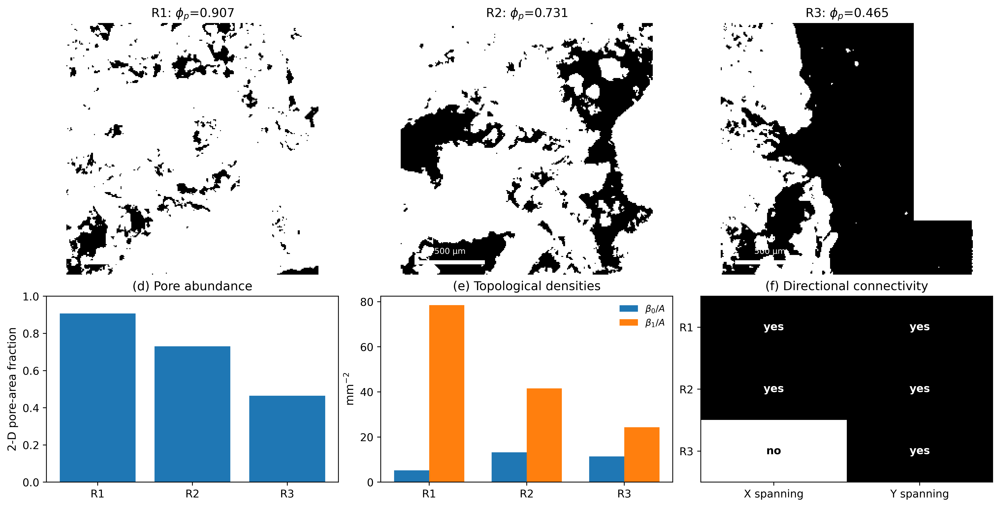

# JTPD — Joukowsky–Topological Pore-Fabric Descriptor

[](https://www.python.org/)
[](LICENSE)
[](#scope-and-scientific-status)
[](#reproduce-the-reference-analysis)

**JTPD** is a scale-aware, interpretable descriptor for **segmented 2-D rock-section pore fabrics**.

It combines physically calibrated pore geometry, digital topology, directional connectivity, interface density, anisotropy, and a contour-based **Joukowsky nonlinear shape response** in one transparent and reproducible workflow.

> This repository accompanies a manuscript prepared for *Journal of Structural Geology*. The implementation and examples are provided so that the proposed descriptor can be inspected, reproduced, and tested on additional segmented rock images.

<p align="center">
  
</p>

## Why JTPD?

Porosity or area fraction measures *how much* pore space is present, but not necessarily *how that pore space is organized*. JTPD separates complementary descriptors of pore fabric:

- **Pore abundance** — 2-D pore-area fraction.
- **Topology** — Betti numbers `β₀`, `β₁`, and Euler characteristic `χ = β₀ − β₁`.
- **Connectivity** — directional X/Y spanning of the pore phase.
- **Interface complexity** — solid–pore interface length per unit area.
- **Shape** — contour anisotropy and Joukowsky area/perimeter response.
- **Scale** — every measurement is tied to an explicit physical pixel size and field area.

The descriptor is deliberately **2-D and scale-aware**. It does not infer 3-D permeability, 3-D connectivity, or lithology-wide universality from the three demonstration fields.

## Included rock-section fields

Three segmented fields from the same source image are included as **R1–R3**, together with acquisition metadata and reference numerical outputs.

| Field | Mask file | Pore-area fraction | β₀/A (mm⁻²) | β₁/A (mm⁻²) | X span | Y span | Interface (mm mm⁻²) | J-area at α=0.25 |
|---|---|---:|---:|---:|:---:|:---:|---:|---:|
| R1 | `patch_y3800_x3800_c0_mask.png` | 0.9072 | 5.2339 | 78.5082 | yes | yes | 11.1558 | 0.9852 |
| R2 | `patch_y7600_x19000_c0_mask.png` | 0.7307 | 13.2386 | 41.5632 | yes | yes | 12.7857 | 0.9918 |
| R3 | `patch_y7600_x53200_c0_mask.png` | 0.4651 | 11.3914 | 24.3221 | no | yes | 6.7776 | 0.9808 |

Reference analysis scale: **7.04 µm px⁻¹**; field side: **1.80224 mm**.

## Download

### Clone the repository

```bash
git clone https://github.com/tromer-unb/Joukowsky-Topological-Pore-Fabric-Descriptor-JTPD-.git
cd Joukowsky-Topological-Pore-Fabric-Descriptor-JTPD-
```

### Download without Git

Use **Code → Download ZIP** on the repository page.

### Ready-to-run bundle

For the descriptor implementation plus the three rock-section masks, metadata, and reference outputs, download:

**[JTPD descriptor + rock fields v0.1.0](bundle/JTPD_descriptor_and_rock_fields_v0.1.0.zip)**

The manuscript is also provided as an **[Overleaf-ready ZIP](paper/JTPD_Overleaf.zip)**.

## Quick start

```bash
python -m venv .venv
source .venv/bin/activate        # Linux/macOS
# .venv\Scripts\Activate.ps1   # Windows PowerShell

python -m pip install --upgrade pip
pip install -r requirements.txt
python jtpd_analysis.py
```

The script regenerates the numerical outputs in `results/` and the publication figures in `figures/`.

## Reproduce the reference analysis

The default workflow performs:

1. physical-scale calibration from `data/Lam_065_metadata.json`;
2. majority downsampling to the requested analysis scale;
3. pore/solid phase statistics;
4. digital topology using **8-connected pore foreground** and **4-connected complement** for holes;
5. directional pore spanning;
6. solid–pore interface density;
7. contour extraction and anisotropy;
8. Joukowsky response for `α = 0.00, 0.10, …, 0.35`;
9. synthetic topology validation;
10. translation, scale, rotation, reflection, and contour-order invariance checks;
11. scale-sensitivity analysis at 128, 256, 512, and 1024 pixels.

Key outputs:

- `results/jtpd_summary.csv` — compact descriptor table for R1–R3.
- `results/jtpd_results.json` — complete machine-readable results.
- `results/scale_sensitivity.csv` — descriptor response across analysis scales.
- `figures/` — reproducible figures for the method and examples.

## Repository structure

```text
.
├── data/
│   ├── README.md
│   ├── Lam_065_metadata.json
│   └── structures/                 # R1–R3 segmented rock fields
├── docs/
│   ├── DATA.md
│   ├── DESCRIPTOR.md
│   └── REPRODUCIBILITY.md
├── figures/                        # Reference figures
├── results/                        # CSV/JSON numerical outputs
├── paper/                          # LaTeX source + Overleaf bundle
├── bundle/                         # Ready-to-run descriptor/data ZIP
├── .github/workflows/              # Automated reproducibility check
├── jtpd_analysis.py                # Full reproducible analysis
├── rock_joukowsky.py               # Joukowsky geometry utilities
├── requirements.txt
└── README.md
```

## Using JTPD on your own segmented image

The reference implementation is intentionally explicit. For a new dataset:

1. prepare a segmented 2-D mask;
2. record the physical source pixel size;
3. adapt `load_solid_mask()` if your phase encoding differs from the included green-dominant solid masks;
4. add your file path and sample name to `MASKS` and `NAMES` in `jtpd_analysis.py`;
5. update the calibration metadata for your dataset;
6. rerun the script and report the effective pixel size together with the descriptor.

See **[docs/DESCRIPTOR.md](docs/DESCRIPTOR.md)** for the mathematical definitions and **[docs/REPRODUCIBILITY.md](docs/REPRODUCIBILITY.md)** for the exact reproducibility protocol.

## Scientific interpretation

JTPD is a **multi-component 2-D morphological descriptor**, not a direct permeability estimator. Comparisons are most defensible when acquisition, segmentation, field size, and effective pixel size are controlled or explicitly reported.

The scale-sensitivity table is included because `β₀`, `β₁`, and interface density are resolution-sensitive by construction. Pore-area fraction is comparatively stable in the included example, whereas topology and interface measures evolve as finer structure becomes resolvable.

## Citation

If you use this implementation, cite the associated JTPD manuscript when its final bibliographic record becomes available. Until then, cite this repository and record the exact commit/release used. See **[CITATION.md](CITATION.md)**.

## Scope and scientific status

This is **research software implementing a proposed descriptor**. The included R1–R3 fields are demonstrations from one source image and are not a statistically representative survey of rock types.

## License

The software is released under the **MIT License**. Data and imagery may carry additional provenance or permission requirements; see **[data/README.md](data/README.md)**.
